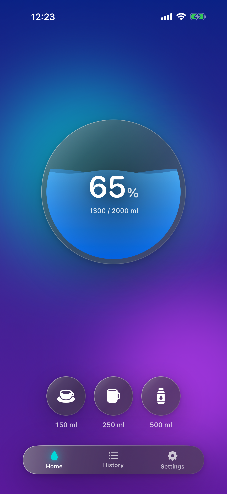
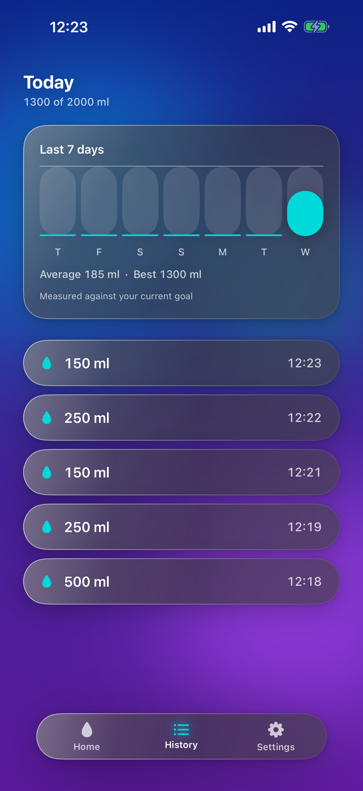
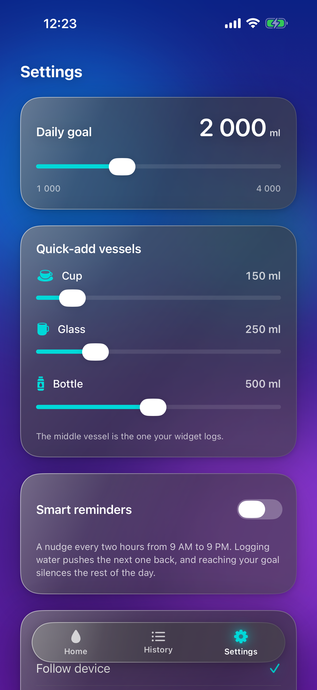
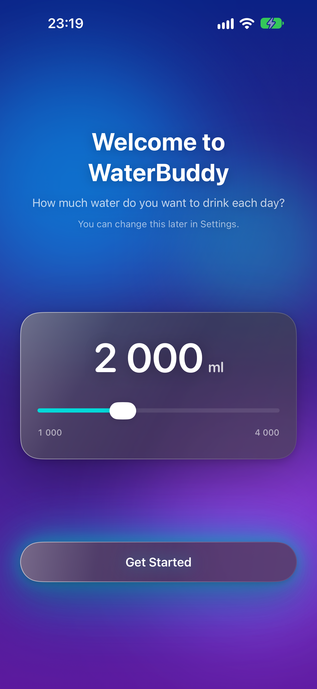

# WaterBuddy

A hydration tracker for iPhone and Apple Watch. Log a glass of water, see how the day is going, and
log again — without opening the app.

No account. No server. No analytics. No third-party dependencies of any kind.

<p align="center">
  
  
  
  
</p>

---

## What it does

- **Three quick-add vessels** — Cup 150 ml, Glass 250 ml, Bottle 500 ml, all editable.
- **A daily goal**, 1,000–4,000 ml in 100 ml steps. Defaults to 2,000 ml.
- **A circular vessel** that fills with animated water, showing percentage and millilitres.
- **History** — today's servings, editable and swipe-to-delete, plus a *Last 7 days* card with
  average and best.
- **Home Screen widget** (small and medium) with an interactive button that logs a serving without
  opening the app.
- **Apple Watch app** — tap the vessel to log; a *More* button reaches the other two amounts. Works
  offline and syncs when the phone is in range.
- **Watch complication** — an `.accessoryCircular` percentage ring.
- **Optional reminders** — every two hours from 9 AM to 9 PM, skipped if you drank in the hour
  before one, and silenced for the rest of the day once the goal is reached.
- **English, Russian and Uzbek**, switchable in-app, applied immediately.

## Requirements

| | |
|---|---|
| iPhone | iOS **17.0** or later. iPhone only — no iPad. |
| Apple Watch | watchOS **26.0** or later (optional; the iPhone app works alone). |
| Build | Xcode 26.6, Swift 5.0 language mode. |

Both floors are compile- and link-verified. Neither has been *run* — no iOS 17.x or watchOS 26.0
simulator runtime is installed on the development machine (`docs/AI_CONTEXT.md`, *Current state*).

---

## Architecture

```
        the app                              the widget extension
  HomeView · HistoryView                HydrationProvider ── reads ──┐
  SettingsView · GoalSetupView                 │                     │
          │                              AddWaterIntent ─── writes ──┤
          ▼                                    │ (@MainActor)        │
    DataManager  ◄─────────────────────────────┘                     │
    @MainActor · @Observable · the only writer                       │
          │                                                          │
    ┌─────┴─────────────────┐                                        │
    ▼                       ▼                                        │
SwiftData                UserDefaults suite  ◄───────────────────────┘
WaterBuddy.store         11 keys, derived cache
source of truth          read by the app AND the widget
app only
```

The Apple Watch is a **third, physically separate process pair** with its own local App Group suite,
written only by `WristModel`. It exchanges data with the phone solely over `WatchConnectivity` —
never through the phone's container.

### The rulings that shape it

- **One writer per store.** `DataManager` owns the phone's SwiftData store and its `UserDefaults`
  cache; `WristModel` owns the watch's own suite. No view, intent or timeline provider writes a key.
- **Today's total is derived, never authored.** It is the sum of today's logs, recomputed after every
  mutation and written back through one setter.
- **The widget's read path never opens SwiftData.** A `TimelineProvider` is `nonisolated` and a
  `ModelContext` is not `Sendable`, so the `UserDefaults` cache is what keeps that read synchronous.
- **The day is stored as a `yyyyMMdd` ordinal, never a `Date`.** An instant is re-read under whatever
  time zone is current, so a user flying west would otherwise lose a day of water on a date that
  never changed.
- **Reset writes the zero before it stamps the day.** A crash between the two leaves a stale marker
  that simply resets again; the opposite order launders yesterday's water into today.
- **Reminders are scheduled from a pure plan.** `ReminderPlan` decides *when* with no
  `UserNotifications` import at all; `NotificationManager` only files and unfiles.

Full reasoning lives in the DocC comments on each type and in [`.claude/rules/`](.claude/rules).

## Targets

Seven targets in one Xcode project, four of them signed.

| Target | Bundle id | Role |
|---|---|---|
| `WaterBuddy` | `sardor.WaterBuddy` | the iPhone app |
| `WaterBuddyWidgetExtension` | `sardor.WaterBuddy.WaterBuddyWidget` | Home Screen widget |
| `WaterBuddyWatch` | `sardor.WaterBuddy.watchkitapp` | the watch app |
| `WaterBuddyWatchWidget` | `…watchkitapp.WaterBuddyWatchWidget` | the complication |
| `WaterBuddyTests` | — | swift-testing, phone side |
| `WaterBuddyUITests` | — | XCTest, phone side |
| `WaterBuddyWatchTests` | — | swift-testing, watch side |

`xcodebuild -list` reports **four** schemes; the three test targets are driven with `-only-testing:`
against the scheme of the app that hosts them.

Six files under `WaterBuddy/` are compiled into more than one target through three separate
`PBXFileSystemSynchronizedBuildFileExceptionSet`s — one per target that reaches in. That set is a
contract, not a convenience: it is what keeps the two front doors logging the same serving.

---

## Building and testing

The gate is **five invocations, not one**. No scheme compiles a sibling's sources, so a widget-only
break passes a green app-scheme test run untouched.

```bash
xcrun simctl shutdown all

xcodebuild test -project WaterBuddy.xcodeproj -scheme WaterBuddy \
  -destination 'platform=iOS Simulator,OS=26.5,name=iPhone 17' \
  -only-testing:WaterBuddyTests -parallel-testing-enabled NO

xcodebuild test -project WaterBuddy.xcodeproj -scheme WaterBuddy \
  -destination 'platform=iOS Simulator,OS=26.5,name=iPhone 17' \
  -only-testing:WaterBuddyUITests -parallel-testing-enabled NO \
  -skip-testing:WaterBuddyUITests/AppStoreScreenshotUITests

xcodebuild test -project WaterBuddy.xcodeproj -scheme WaterBuddyWatch \
  -destination 'platform=watchOS Simulator,OS=26.5,name=Apple Watch Series 11 (46mm)' \
  -only-testing:WaterBuddyWatchTests -parallel-testing-enabled NO

xcodebuild build -project WaterBuddy.xcodeproj -scheme WaterBuddyWidgetExtension \
  -destination 'platform=iOS Simulator,OS=26.5,name=iPhone 17'

xcodebuild build -project WaterBuddy.xcodeproj -scheme WaterBuddyWatchWidget \
  -destination 'platform=watchOS Simulator,OS=26.5,name=Apple Watch Series 11 (46mm)'
```

Latest run — 2026-09-02:

| | |
|---|---|
| Phone unit | `✔ 300 tests in 33 suites passed` |
| Phone UI | `Executed 25 tests, with 0 failures` |
| Watch unit | `✔ 29 tests in 5 suites passed` |
| Both widget builds | `** BUILD SUCCEEDED **` |

**`OS=26.5` is load-bearing.** More than one runtime of each platform is installed, so an unpinned
destination is ambiguous. `-skip-testing:…/AppStoreScreenshotUITests` is also mandatory — that class
is a capture harness, not a test, and is deliberately non-idempotent.

**A green suite is not proof the product works.** The tests inject their own `UserDefaults`,
`Calendar` and clock, so they structurally cannot see a missing entitlement, a file left out of a
target, or a widget that renders blank. Neither widget's rendering has any automated coverage on
either platform.

### Known warning baseline

A full scheme build emits **38** warnings, all of the *"main actor-isolated … cannot be referenced
from a nonisolated context"* class in `DataManager.swift` and `NotificationManager.swift`. They are
pre-existing and unrelated to recent work — proven by building at two different deployment targets
and diffing the warning sets, which come out identical. The rule is *no **new** warnings against that
baseline*; closing it is tracked as known issue #29.

---

## Screenshots

`Tools/` holds a capture harness. Nothing in it is compiled into any target.

```bash
bash Tools/CaptureScreenshots.sh                      # the 4 store shots, 6.9"
WATERBUDDY_SCREENSHOT_SLOT=iPhone-6.5 \
WATERBUDDY_SCREENSHOT_PHONE=<udid> \
  bash Tools/CaptureScreenshots.sh                    # the same, 6.5"
bash Tools/CaptureFullCensus.sh                       # 25 shots: every screen, state, scroll position
bash Tools/CaptureWatchScreenshot.sh                  # the watch (pauses for a human tap)
bash Tools/VerifyScreenshots.sh                       # size / alpha / format, per App Store slot
```

Two traps these encode, both of which cause an upload rejection rather than a visible failure:

- **App Store Connect validates pixel size against the *slot* you upload to.** A 6.9″ capture
  (1320×2868) in the 6.5″ well is refused. Only one iPhone size is actually required.
- **`simctl io screenshot` writes RGBA on watchOS even with `--mask=ignored`**, because the display
  is non-rectangular — and Connect rejects any screenshot with an alpha channel.
  `Tools/FlattenPNG.swift` re-encodes to colour type 2 with the RGB planes byte-identical.

Neither capture script erases a simulator. They detect a dirty device and print the command for a
human, because erasing is destructive.

---

## Privacy

- No account, no sign-up, no server, no cloud.
- No analytics, no tracking, no ads, no third-party SDKs. There is **no networking code in the app at
  all** — `URLSession`, `Network`, `CloudKit`, `HealthKit`, `CoreLocation` and every third-party SDK
  are banned by rule and absent in fact.
- The only entitlement on any target is the App Group. `WatchConnectivity` needs none.
- Data leaves the device only between the user's own paired iPhone and Apple Watch.
- **Reminder text contains no digits** — not the total, the goal or the serving, in any language. A
  lock screen is a public surface, and a test asserts the copy is digit-free.
- Four `PrivacyInfo.xcprivacy` manifests, one per shipping bundle, declare the app's `UserDefaults`
  access as a required-reason API (`1C8F.1` App Group, `CA92.1` app-only).

## Repository layout

```
WaterBuddy/              the app — SwiftUI, @Observable DataManager over SwiftData
WaterBuddyWidget/        the Home Screen widget — StaticConfiguration + AddWaterIntent
WaterBuddyWatch/         the watch app — WristView over its own local suite
WaterBuddyWatchWidget/   the complication — .accessoryCircular
WaterBuddy*Tests/        three test targets, two platforms
Entitlements/            one App Group entitlement per signed target
Tools/                   standalone scripts, in no build target
Screenshots/             App Store assets
docs/                    AI_CONTEXT · STATE · WIDGET · DESIGN
.claude/rules/           the engineering rules this codebase is held to
```

`CLAUDE.md` and `.claude/**` are committed as files and are never members of a build target.

## License

Not yet chosen. All rights reserved until one is added.

---

# App Store Connect

Everything needed to fill in the listing. **Character counts were verified programmatically**, not
estimated — every field is inside Apple's limit, and two are exactly at it.

Fields marked 🔴 **you must supply**; nothing in the repo can answer them.

## App Information

| Field | Value |
|---|---|
| **Name** (≤30) | `WaterBuddy - Hydration Tracker` — **30/30** |
| **Subtitle** (≤30) | `One tap. No account. No cloud.` — **30/30** |
| **Bundle ID** | `sardor.WaterBuddy` |
| **SKU** | 🔴 your choice, e.g. `waterbuddy-ios-001` |
| **Primary category** | Health & Fitness |
| **Secondary category** | Lifestyle *(optional; may be left empty)* |
| **Primary language** | English (U.S.) |
| **Content rights** | Contains no third-party content |
| **Age rating** | **4+** — answer *None* to every question. No violence, no mature themes, no gambling, no user-generated content, no web access, no ads |
| **Price** | Free, no in-app purchases |
| **Availability** | 🔴 your choice of territories |

## URLs 🔴

All three are yours to provide. **The privacy policy URL is mandatory** — Apple requires it even for
an app that collects nothing.

| Field | |
|---|---|
| **Privacy Policy URL** | 🔴 required. A single page saying the app collects no data is enough |
| **Support URL** | 🔴 required. A GitHub Issues page or a contact page is acceptable |
| **Marketing URL** | optional |

## Promotional text (≤170) — **167/170**

Editable any time without submitting a new build.

```
See the widget. Tap it. A glass is logged, the app never opened. Same tap on your wrist. Watch the vessel fill toward your goal. No account, no cloud, nothing tracked.
```

## Keywords (≤100) — **100/100 exactly**

No spaces after the commas — a space costs a character. No token repeats the app name or subtitle,
because Apple already indexes those.

```
drink,intake,reminder,goal,daily,glass,bottle,cup,ml,log,widget,offline,private,h2o,thirst,habit,sip
```

> If you change the **name** or the **subtitle**, re-check this list for overlap and re-count.

## Description (≤4000) — **2739/4000**

The first ~170 characters are all that show before the "more" link, so the opening sentence carries
the whole pitch on its own.

```
See it, tap it, done. WaterBuddy logs a glass from your Home Screen widget or your Apple Watch in a single tap - no account, no server, nothing to sign up for.

A water tracker only earns its place if you are still using it in week three, and the surest way to keep using one is never having to stop what you are doing.

LOGGING
- Three quick-add vessels: Cup 150 ml, Glass 250 ml, Bottle 500 ml. All three amounts are editable, so they match the glass on your desk and the bottle in your bag.
- A daily goal anywhere from 1,000 to 4,000 ml, in 100 ml steps. It starts at 2,000 ml.
- A circular vessel fills with animated water, showing today's percentage and the exact millilitres.
- Cross the goal and the screen throws confetti.

WITHOUT OPENING THE APP
- Home Screen widget, small and medium, with a button that logs a serving right there. It pours your middle quick-add vessel, whatever you have set it to.
- Apple Watch app: tap the vessel to log a serving, or tap More to reach the other two amounts. It works with your iPhone nowhere near you, and syncs across once you are back in range.
- Apple Watch complication: a circular percentage ring for your watch face, so today's progress is simply there.

LOOKING BACK
- Today's servings as a list you can edit, or swipe away when you tap the wrong one. A mistap is a one-second fix.
- A Last 7 days bar card with your average and your best day.

REMINDERS THAT KNOW WHEN TO STOP
Optional, and off until you turn them on: a nudge every two hours, from 9 AM to 9 PM. Log some water and the next one moves back. Reach your goal and the rest of the day stays quiet. The reminder text contains no numbers at all, deliberately: a lock screen is a public surface, and what you have drunk today is nobody else's business.

PRIVATE BY CONSTRUCTION
No account. No sign-up. No email address. No server, and no cloud.

No analytics, no tracking, no ads, and no third-party SDKs of any kind - the project has zero dependencies, and every framework in it is Apple's own. There is no networking code in WaterBuddy anywhere, so what you log has no way to leave your device. The only place it travels is between your own paired iPhone and Apple Watch.

MADE TO LIVE WITH
- A dark liquid-glass design over a slowly moving aurora gradient.
- English, Russian and Uzbek, switched inside the app and applied immediately.
- Full VoiceOver support, Dynamic Type, Reduce Motion and Reduce Transparency.

WHAT IT IS NOT
It is not a health app and it makes no health claims. No HealthKit. No friends, no feeds, no leaderboards. No coffee, tea or other drinks: water, and nothing else.

Requires an iPhone running iOS 17.0 or later; there is no iPad version. The Apple Watch app requires watchOS 26.0 or later.
```

## What's New — version 1.0

```
WaterBuddy 1.0 - the first release.

Log a serving by tapping Cup, Glass or Bottle - 150, 250 and 500 ml, all editable - and watch a circular vessel fill toward a daily goal you set between 1,000 and 4,000 ml.

Also here from day one: a Home Screen widget with a button that logs without opening the app, an Apple Watch app that works out of range and syncs when it is back, a circular percentage ring for your watch face, optional two-hourly reminders that stop once you reach your goal, and English, Russian and Uzbek.

No account, no server, no analytics, no third-party code. Everything you log stays on your own devices.
```

## App Privacy

This is the questionnaire in the sidebar, and it is **separate from** the `PrivacyInfo.xcprivacy`
files in the repo. Those declare *API usage*; this declares *data collection*.

> **Answer: "Data Not Collected"** — select it and you are done. Do not tick a single data type.

Every category is answered by the same fact: there is no networking code in the app, so there is no
mechanism by which data could be collected.

| Question | Answer |
|---|---|
| Do you collect data from this app? | **No** |
| Contact info, Health, Financial, Location, Identifiers, Usage, Diagnostics | **None** |
| Third-party analytics / advertising | **None** |
| Tracking (ATT) | **No** — the app does not track |

## Export compliance

Already answered **in the build** via `INFOPLIST_KEY_ITSAppUsesNonExemptEncryption = NO`, so App
Store Connect should not prompt. If it does:

| Question | Answer |
|---|---|
| Does your app use encryption? | **No** |
| Exempt? | n/a — the app uses no encryption of any kind |

## Screenshots

Ready in [`Screenshots/en-US/`](Screenshots/en-US). **Only one iPhone size is required** — Apple's
spec makes 6.5″ *"required if screenshots for 6.9″ display aren't provided"* — but Connect validates
pixel size against the well you upload to, so both are supplied.

| Slot | Size | Files |
|---|---|---|
| iPhone 6.9″ | 1320 × 2868 | 4 |
| iPhone 6.5″ | 1284 × 2778 | 4 |
| Apple Watch | 416 × 496 | 1 — **required**, because the app embeds a watchOS app |

Only the **first three** appear on install cards, so upload in this order: `01-home`, `02-history`,
`03-settings`, `04-goal-setup`.

## Review notes

```
No account or login is required — the app opens straight to a goal-setup screen and is fully usable
immediately. No demo credentials are needed.

The app collects no data and contains no networking code. Everything is stored locally in an App
Group container shared between the app and its widget; the Apple Watch app syncs over
WatchConnectivity between the user's own paired devices only.

Notification permission is requested only when the user turns on the optional reminders toggle in
Settings, never at launch.
```

| Field | |
|---|---|
| Sign-in required | **No** |
| Demo account | Not needed |
| Contact 🔴 | your name, phone, email |

---

## Before you submit — outstanding

- 🔴 **Distribution certificate.** Only an *Apple Development* identity exists on the build machine.
  Xcode normally creates a distribution one during **Distribute App**; if it errors, that is why.
- 🔴 **App Group registration.** The entitlement files are correct, but a distribution profile only
  carries `group.sardor.WaterBuddy` if it is registered on the developer portal for all four bundle
  IDs.
- **The watch screenshot is the empty state** (0%, "Not yet synced"). App Review guideline 2.3.3
  wants the app *in use*; a populated alternative can be captured with
  `bash Tools/CaptureWatchScreenshot.sh`. Tracked as known issue #32.
- **The app icon appears only after a build is processed.** The 1024² marketing icon ships *inside*
  the binary's asset catalog — App Store Connect has no icon upload field. The placeholder shown
  before your first upload is expected, not a fault.
